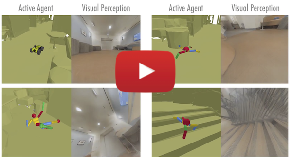

# GIBSON ENVIRONMENT for Embodied Active Agents with Real-World Perception 
[](https://github.com/micheleantonazzi/GibsonEnv/actions/workflows/build_ubuntu_latest.yml)
[](https://github.com/micheleantonazzi/GibsonEnv/actions/workflows/build_manylinux_2010_2014.yml)
[](https://pypi.org/project/gibson/)

You shouldn't play video games all day, so shouldn't your AI! We built a virtual environment simulator, Gibson, that offers real-world experience for learning perception.  


**Summary**: Perception and being active (i.e. having a certain level of motion freedom) are closely tied. Learning active perception and sensorimotor control in the physical world is cumbersome as existing algorithms are too slow to efficiently learn in real-time and robots are fragile and costly. This has given a fruitful rise to learning in the simulation which consequently casts a question on transferring to real-world. We developed Gibson environment with the following primary characteristics:  

**I.** being from the real-world and reflecting its semantic complexity through virtualizing real spaces,  
**II.** having a baked-in mechanism for transferring to real-world (Goggles function), and  
**III.** embodiment of the agent and making it subject to constraints of space and physics via integrating a physics engine ([Bulletphysics](http://bulletphysics.org/wordpress/)).  

**Naming**: Gibson environment is named after *James J. Gibson*, the author of "Ecological Approach to Visual Perception", 1979. “We must perceive in order to move, but we must also move in order to perceive” – JJ Gibson

Please see the [website](http://gibson.vision/) (http://gibsonenv.stanford.edu/) for more technical details. This repository is intended for distribution of the environment and installation/running instructions.

#### Paper
**["Gibson Env: Real-World Perception for Embodied Agents"](http://gibson.vision/)**, in **CVPR 2018 [Spotlight Oral]**.


[](https://youtu.be/KdxuZjemyjc "Click to watch the video summarizing Gibson environment!")


## Release

**This is the 0.7.0 release. Bug reports, suggestions for improvement, as well as community developments are encouraged and appreciated.** [change log file](misc/CHANGELOG.md).

## Database

The full database includes 572 spaces and 1440 floors and can be downloaded [here](gibson/data/README.md). A diverse set of visualizations of all spaces in Gibson can be seen [here](http://gibsonenv.stanford.edu/database/). To make the core assets download package lighter for the users, we  include a small subset (39) of the spaces. Users can download the rest of the spaces and add them to the assets folder. We also integrated [Stanford 2D3DS](http://3dsemantics.stanford.edu/) and [Matterport 3D](https://niessner.github.io/Matterport/) as separate datasets if one wishes to use Gibson's simulator with those datasets (access [here](gibson/data/README.md)).

## Table of contents


   * [Installation](#installation)

        * [Download data](#download-data)
        * [Quick installation (pip)](#a-quick-installation-pip)
        * [Building from source](#b-building-from-source)
        * [Docker installation](#c-docker-installation)
        * [Uninstalling](#uninstalling)
   * [Quick Start](#quick-start)
        * [Gibson FPS](#gibson-framerate)
        * [Web User Interface](#web-user-interface)
        * [Rendering Semantics](#rendering-semantics)
        * [Robotic Agents](#robotic-agents)
        * [ROS Configuration](#ros-configuration)
   * [Coding your RL agent](#coding-your-rl-agent)
   * [Environment Configuration](#environment-configuration)
   * [Goggles: transferring the agent to real-world](#goggles-transferring-the-agent-to-real-world)
   * [Citation](#citation)

#### System requirements

The minimum system requirements are the following:

For docker installation (A): 
- Ubuntu 16.04
- Nvidia GPU with VRAM > 6.0GB
- Nvidia driver >= 384
- CUDA >= 9.0, CuDNN >= v7

For building from the source(B):
- Ubuntu >= 14.04
- Nvidia GPU with VRAM > 6.0GB
- Nvidia driver >= 375
- CUDA >= 8.0, CuDNN >= v5

# Installation

## Download data

After the installation of Gibson, you have to set up the assets data (agent models, environments, etc). The folder that stores the necessary data to run Gibson environment must be set by the user. To do this, simply run this command ```gibson-set-assets-path``` in a terminal and then follow the printed instructions. This script asks you to insert the path where to save the Gibson assets. Inside this folder, you have to copy the environment core assets data (available [here](https://storage.googleapis.com/gibson_scenes/assets_core_v2.tar.gz) ~= 300MB) and the environments data (downloadable from [here](https://storage.googleapis.com/gibson_scenes/dataset.tar.gz) ~= 10GB). The environment data must be located inside a sub-directory called `dataset`. You can add more environments by adding them inside the `dataset` folder located in the previously set path. Users can download and copy manually these data inside the correct path or they can use dedicated python utilities. To easily download Gibson assets, typing in a terminal:

```bash
gibson-set-assets-path # This command allows you to set the default Gibson assets folder
gibson-download-assets-core
gibson-download-dataset
```

 Visit the [database readme](gibson/data/README.md) for downloading more spaces. Please sign the [license agreement](gibson/data/README.md#download) before using Gibson's database.

## A. Quick installation (pip)

The easiest way to install Gibson is to use the precompiled version, stored on pip. 
This version only works on Linux machines. Remember to install CUDA Toolkit before using Gibson.
```bash
sudo apt install libopenmpi-dev # Required to compile mpi4pi
pip install gibson
```

## B. Building from source

If you don't want to use the precompiled version, you can also install gibson locally. This will require some dependencies to be installed.

First, make sure you have Nvidia driver and CUDA installed. Then, let's install some dependencies:
Then clone this repo recursively and install some dependencies:

```bash
git clone https://github.com/micheleantonazzi/GibsonEnv.git --recursive
apt-get update 
apt-get install doxygen libglew-dev xorg-dev libglu1-mesa-dev libboost-dev \
      mesa-common-dev freeglut3-dev libopenmpi-dev cmake golang libjpeg-turbo8-dev wmctrl \
      xdotool libzmq3-dev zlib1g-dev libsdl-image1.2-dev libsdl-mixer1.2-dev libsdl-ttf2.0-dev \
      libportmidi-dev libfreetype6-dev
```

Finally, build and install the package using pip:
```bash
pip install -e . ### Gibson build
```

Install OpenAI baselines if you need to run the training demo.

```bash
git clone https://github.com/fxia22/baselines.git
pip install -e baselines
```

## C. Docker installation

If yuo want ot use docker, you need to install [docker](https://docs.docker.com/engine/installation/) and [nvidia-docker2.0](https://github.com/nvidia/nvidia-docker/wiki/Installation-(version-2.0)) first. 

Run `docker run --runtime=nvidia --rm nvidia/cuda nvidia-smi` to verify your installation. 

You can either 1. pull from our docker image (recommended) or 2. build your own docker image.


1. Pull from our docker image (recommended)

```bash
# download the dataset from https://storage.googleapis.com/gibson_scenes/dataset.tar.gz
docker pull xf1280/gibson:0.3.1
xhost +local:root
docker run --runtime=nvidia -ti --rm -e DISPLAY -v /tmp/.X11-unix:/tmp/.X11-unix -v <host path to dataset folder>:/root/mount/gibson/gibson/assets/dataset xf1280/gibson:0.3.1
```

2. Build your own docker image 
```bash
git clone https://github.com/StanfordVL/GibsonEnv.git
cd GibsonEnv
docker build . -t gibson ### finish building inside docker, note by default, dataset will not be included in the docker images
xhost +local:root ## enable display from docker
```
If the installation is successful, you should be able to run `docker run --runtime=nvidia -ti --rm -e DISPLAY -v /tmp/.X11-unix:/tmp/.X11-unix -v <host path to dataset folder>:/root/mount/gibson/gibson/assets/dataset gibson` to create a container. Note that we don't include
dataset files in docker image to keep our image slim, so you will need to mount it to the container when you start a container. 

#### Notes on deployment on a headless server

Gibson Env supports deployment on a headless server and remote access with `x11vnc`. 
You can build your own docker image with the docker file `Dockerfile` as above.
Instructions to run gibson on a headless server (requires X server running):

1. Install nvidia-docker2 dependencies following the starter guide. Install `x11vnc` with `sudo apt-get install x11vnc`.
2. Have xserver running on your host machine, and run `x11vnc` on DISPLAY :0.
3. `docker run --runtime=nvidia -ti --rm -e DISPLAY -v /tmp/.X11-unix/X0:/tmp/.X11-unix/X0 -v <host path to dataset folder>:/root/mount/gibson/gibson/assets/dataset <gibson image name>`
4. Run gibson with `python <gibson example or training>` inside docker.
5. Visit your `host:5900` and you should be able to see the GUI.

If you don't have X server running, you can still run gibson, see [this guide](https://github.com/StanfordVL/GibsonEnv/wiki/Running-GibsonEnv-on-headless-server) for more details.

## Uninstalling


Uninstall gibson is easy. If you installed with docker, just run `docker images -a | grep "gibson" | awk '{print $3}' | xargs docker rmi` to clean up the image. If you installed from source or from pip, uninstall with `pip uninstall gibson`

# Quick Start

First of all, setup the assets data path typing `gibson-set-assets-path` in a terminal. Then, download the assets data and the environments dataset using these commands:

```bash
gibson-download-assets-core
gibson-download-dataset
```

First run `xhost +local:root` on your host machine to enable display. You may need to run `export DISPLAY=:0` first. After getting into the docker container with `docker run --runtime=nvidia -ti --rm -e DISPLAY -v /tmp/.X11-unix:/tmp/.X11-unix -v <host path to dataset folder>:/root/mount/gibson/gibson/assets/dataset gibson`, you will get an interactive shell. Now you can run a few demos. 

If you installed from pip or from source, you can run those directly using the following commands without using docker. 


```bash
python examples/demo/play_husky_nonviz.py ### Use ASWD keys on your keyboard to control a car to navigate around Gates building
```


You will be able to use ASWD keys on your keyboard to control a car to navigate around Gates building. A camera output will not be shown in this particular demo. 

```bash
python examples/demo/play_husky_camera.py ### Use ASWD keys on your keyboard to control a car to navigate around Gates building, while RGB and depth camera outputs are also shown.
```


You will able to use ASWD keys on your keyboard to control a car to navigate around Gates building. You will also be able to see the RGB and depth camera outputs. 

```bash
python examples/train/train_husky_navigate_ppo2.py ### Use PPO2 to train a car to navigate down the hallway in Gates building, using visual input from the camera.
```


By running this command you will start training a husky robot to navigate in Gates building and go down the corridor with RGBD input. You will see some RL related statistics in the terminal after each episode.


```bash
python examples/train/train_ant_navigate_ppo1.py ### Use PPO1 to train an ant to navigate down the hallway in Gates building, using visual input from the camera.
```


By running this command you will start training an ant to navigate in Gates building and go down the corridor with RGBD input. You will see some RL related statistics in the terminal after each episode.


## Gibson Framerate

Below is Gibson Environment's framerate benchmarked on different platforms. Please refer to [fps branch](https://github.com/StanfordVL/GibsonEnv/tree/fps) for the code to reproduce the results.
<table class="table">
  <tr>
    <th scope="row">Platform</th>
    <td colspan="3">Tested on Intel E5-2697 v4 + NVIDIA Tesla V100</td>
  </tr>
  <tr>
    <th scope="col">Resolution [nxn]</th>
    <th scope="col">128</th>
    <th scope="col">256</th>
    <th scope="col">512</th>
 </tr>
  <tr>
    <th scope="row">RGBD, pre network<code>f</code></th>
    <td>109.1</td>
    <td>58.5</td>
    <td>26.5</td>
  </tr>
  <tr>
    <th scope="row">RGBD, post network<code>f</code></th>
    <td>77.7</td>
    <td>30.6</td>
    <td>14.5</td>
  </tr>
  <tr>
    <th scope="row">RGBD, post small network<code>f</code></th>
    <td>87.4</td>
    <td>40.5</td>
    <td>21.2</td>
  </tr>
  <tr>
    <th scope="row">Depth only</th>
    <td>253.0</td>
    <td>197.9</td>
    <td>124.7</td>
  </tr>
  <tr>
    <th scope="row">Surface Normal only</th>
    <td>207.7</td>
    <td>129.7</td>
    <td>57.2</td>
  </tr>
  <tr>
    <th scope="row">Semantic only</th>
    <td>190.0</td>
    <td>144.2</td>
    <td>55.6</td>
  </tr>
  <tr>
    <th scope="row">Non-Visual Sensory</th>
    <td>396.1</td>
    <td>396.1</td>
    <td>396.1</td>
  </tr>
</table>

We also tested on <code>Intel I7 7700 + NVIDIA GeForce GTX 1070Ti</code> and <code>Tested on Intel I7 6580k + NVIDIA GTX 1080Ti</code> platforms. The FPS difference is within 10% on each task.

<table class="table">
    <tr>
        <th scope="row">Platform</th>
        <td colspan="6">Multi-process FPS tested on Intel E5-2697 v4 + NVIDIA Tesla V100</td>
    </tr>
    <tr>
      <th scope="col">Configuration</th>
      <th scope="col">512x512 episode sync</th>
      <th scope="col">512x512 frame sync</th>
      <th scope="col">256x256 episode sync</th>
      <th scope="col">256x256 frame sync</th>
      <th scope="col">128x128 episode sync</th>
      <th scope="col">128x128 frame sync</th>
    </tr>
    <tr>
      <th scope="row">1 process</th>
      <td>12.8</td>
      <td>12.02</td>
      <td>32.98</td>
      <td>32.98</td>
      <td>52</td>
      <td>52</td>
    </tr>
    <tr>
      <th scope="row">2 processes</th>
      <td>23.4</td>
      <td>20.9</td>
      <td>60.89</td>
      <td>53.63</td>
      <td>86.1</td>
      <td>101.8</td>
    </tr>
    <tr>
      <th scope="row">4 processes</th>
      <td>42.4</td>
      <td>31.97</td>
      <td>105.26</td>
      <td>76.23</td>
      <td>97.6</td>
      <td>145.9</td>
    </tr>
    <tr>
      <th scope="row">8 processes</th>
      <td>72.5</td>
      <td>48.1</td>
      <td>138.5</td>
      <td>97.72</td>
      <td>113</td>
      <td>151</td>
    </tr>
</table>


## Web User Interface

When running Gibson, you can start a web user interface with `python gibson/utils/web_ui.py python gibson/utils/web_ui.py 5552`. This is helpful when you cannot physically access the machine running gibson or you are running on a headless cloud environment. You need to change `mode` in configuration file to `web_ui` to use the web user interface.


## Rendering Semantics


Gibson can provide pixel-wise frame-by-frame semantic masks when the model is semantically annotated. As of now we have incorporated models from [Stanford 2D-3D-Semantics Dataset](http://buildingparser.stanford.edu/) and [Matterport 3D](https://niessner.github.io/Matterport/) for this purpose. You can access them within Gibson [here](https://github.com/StanfordVL/GibsonEnv/blob/master/gibson/data/README.md#download-gibson-database-of-spaces). We refer you to the original dataset's reference for the list of their semantic classes and annotations. 

For detailed instructions of rendering semantics in Gibson, see [semantic instructions](gibson/utils/semantics.md). As one example in the starter dataset that comes with installation, `space7` includes Stanford 2D-3D-Semantics style annotation. 

<!---
**Agreement**: If you choose to use the models from [Stanford 2D3DS](http://3dsemantics.stanford.edu/) or [Matterport 3D](https://niessner.github.io/Matterport/) for rendering semantics, please sign their respective license agreements. Stanford 2D3DS's agreement is inclued in Gibson Database's agreement and does not need to be signed again. For Matterport3D, please see [here](https://niessner.github.io/Matterport/).
--->

## Robotic Agents


Gibson provides a base set of agents. See videos of these agents and their corresponding perceptual observation [here](http://gibsonenv.stanford.edu/agents/). 


To enable (optionally) abstracting away low-level control and robot dynamics for high-level tasks, we also provide a set of practical and ideal controllers for each agent.

| Agent Name     | DOF | Information      | Controller |
|:-------------: | :-------------: |:-------------: |:-------------|
| Mujoco Ant      | 8   | [OpenAI Link](https://blog.openai.com/roboschool/) | Torque |
| Mujoco Humanoid | 17  | [OpenAI Link](https://blog.openai.com/roboschool/) | Torque |
| Husky Robot     | 4   | [ROS](http://wiki.ros.org/Robots/Husky), [Manufacturer](https://www.clearpathrobotics.com/) | Torque, Velocity, Position |
| Minitaur Robot  | 8   | [Robot Page](https://www.ghostrobotics.io/copy-of-robots), [Manufacturer](https://www.ghostrobotics.io/) | Sine Controller |
| JackRabbot      | 2   | [Stanford Project Link](http://cvgl.stanford.edu/projects/jackrabbot/) | Torque, Velocity, Position |
| TurtleBot       | 2   | [ROS](http://wiki.ros.org/Robots/TurtleBot), [Manufacturer](https://www.turtlebot.com/) | Torque, Velocity, Position |
| Quadrotor         | 6   | [Paper](https://repository.upenn.edu/cgi/viewcontent.cgi?referer=https://www.google.com/&httpsredir=1&article=1705&context=edissertations) | Position |


### Starter Code 

More demonstration examples can be found in `examples/demo` folder

| Example        | Explanation          |
|:-------------: |:-------------|
|`play_ant_camera.py`|Use 1234567890qwerty keys on your keyboard to control an ant to navigate around Gates building, while RGB and depth camera outputs are also shown. |
|`play_ant_nonviz.py`| Use 1234567890qwerty keys on your keyboard to control an ant to navigate around Gates building.|
|`play_drone_camera.py`| Use ASWDZX keys on your keyboard to control a drone to navigate around Gates building, while RGB and depth camera outputs are also shown.|
|`play_drone_nonviz.py`| Use ASWDZX keys on your keyboard to control a drone to navigate around Gates building|
|`play_humanoid_camera.py`| Use 1234567890qwertyui keys on your keyboard to control a humanoid to navigate around Gates building. Just kidding, controlling humaniod with keyboard is too difficult, you can only watch it fall. Press R to reset. RGB and depth camera outputs are also shown. |
|`play_humanoid_nonviz.py`| Watch a humanoid fall. Press R to reset.|
|`play_husky_camera.py`| Use ASWD keys on your keyboard to control a car to navigate around Gates building, while RGB and depth camera outputs are also shown.|
|`play_husky_nonviz.py`| Use ASWD keys on your keyboard to control a car to navigate around Gates building|

More training code can be found in `examples/train` folder.

| Example        | Explanation          |
|:-------------: |:-------------|
|`train_husky_navigate_ppo2.py`|   Use PPO2 to train a car to navigate down the hallway in Gates building, using RGBD input from the camera.|
|`train_husky_navigate_ppo1.py`|   Use PPO1 to train a car to navigate down the hallway in Gates building, using RGBD input from the camera.|
|`train_ant_navigate_ppo1.py`| Use PPO1 to train an ant to navigate down the hallway in Gates building, using visual input from the camera. |
|`train_ant_climb_ppo1.py`| Use PPO1 to train an ant to climb down the stairs in Gates building, using visual input from the camera.  |
|`train_ant_gibson_flagrun_ppo1.py`| Use PPO1 to train an ant to chase a target (a red cube) in Gates building. Everytime the ant gets to target(or time out), the target will change position.|
|`train_husky_gibson_flagrun_ppo1.py`|Use PPO1 to train a car to chase a target (a red cube) in Gates building. Everytime the car gets to target(or time out), the target will change position. |

## ROS Configuration


We provide examples of configuring Gibson with ROS [here](examples/ros/gibson-ros). We use turtlebot as an example, after a policy is trained in Gibson, it requires minimal changes to deploy onto a turtlebot. See [README](examples/ros/gibson-ros) for more details.


## Coding Your RL Agent

You can code your RL agent following our convention. The interface with our environment is very simple (see some examples in the end of this section).

First, you can create an environment by creating an instance of classes in `gibson/core/envs` folder. 


```python
env = AntNavigateEnv(is_discrete=False, config = config_file)
```

Then do one step of the simulation with `env.step`. And reset with `env.reset()`
```python
obs, rew, env_done, info = env.step(action)
```
`obs` gives the observation of the robot. It is a dictionary with each component as a key value pair. Its keys are specified by user inside config file. E.g. `obs['nonviz_sensor']` is proprioceptive sensor data, `obs['rgb_filled']` is rgb camera data.

`rew` is the defined reward. `env_done` marks the end of one episode, for example, when the robot dies. 
`info` gives some additional information of this step; sometimes we use this to pass additional non-visual sensor values.

We mostly followed [OpenAI gym](https://github.com/openai/gym) convention when designing the interface of RL algorithms and the environment. In order to help users start with the environment quicker, we
provide some examples at [examples/train](examples/train). The RL algorithms that we use are from [openAI baselines](https://github.com/openai/baselines) with some adaptation to work with hybrid visual and non-visual sensory data.
In particular, we used [PPO](https://github.com/openai/baselines/tree/master/baselines/ppo1) and a speed optimized version of [PPO](https://github.com/openai/baselines/tree/master/baselines/ppo2).


## Environment Configuration

Each environment is configured with a `yaml` file. Examples of `yaml` files can be found in `examples/configs` folder. Parameters for the file is explained below. For more informat specific to Bullet Physics engine, you can see the documentation [here](https://docs.google.com/document/d/10sXEhzFRSnvFcl3XxNGhnD4N2SedqwdAvK3dsihxVUA/edit).

| Argument name        | Example value           | Explanation  |
|:-------------:|:-------------:| :-----|
| envname      | AntClimbEnv | Environment name, make sure it is the same as the class name of the environment |
| model_id      | space1-space8      |   Scene id, in beta release, choose from space1-space8 |
| target_orn | [0, 0, 3.14]      |   Eulerian angle (in radian) target orientation for navigating, the reference frame is world frame. For non-navigation tasks, this parameter is ignored. |
|target_pos | [-7, 2.6, -1.5] | target position (in meter) for navigating, the reference frame is world frame. For non-navigation tasks, this parameter is ignored. |
|initial_orn | [0, 0, 3.14] | initial orientation (in radian) for navigating, the reference frame is world frame |
|initial_pos | [-7, 2.6, 0.5] | initial position (in meter) for navigating, the reference frame is world frame|
|fov | 1.57  | field of view for the camera, in radian |
| use_filler | true/false  | use neural network filler or not. It is recommended to leave this argument true. See [Gibson Environment website](http://gibson.vision/) for more information. |
|display_ui | true/false  | Gibson has two ways of showing visual output, either in multiple windows, or aggregate them into a single pygame window. This argument determines whether to show pygame ui or not, if in a production environment (training), you need to turn this off |
|show_diagnostics | true/false  | show dignostics(including fps, robot position and orientation, accumulated rewards) overlaying on the RGB image |
|ui_num |2  | how many ui components to show, this should be length of ui_components. |
| ui_components | [RGB_FILLED, DEPTH]  | which are the ui components, choose from [RGB_FILLED, DEPTH, NORMAL, SEMANTICS, RGB_PREFILLED] |
|output | [nonviz_sensor, rgb_filled, depth]  | output of the environment to the robot, choose from  [nonviz_sensor, rgb_filled, depth]. These values are independent of `ui_components`, as `ui_components` determines what to show and `output` determines what the robot receives. |
|resolution | 512 | choose from [128, 256, 512] resolution of rgb/depth image |
|initial_orn | [0, 0, 3.14] | initial orientation (in radian) for navigating, the reference frame is world frame |
|speed : timestep | 0.01 | length of one physics simulation step in seconds(as defined in [Bullet](https://docs.google.com/document/d/10sXEhzFRSnvFcl3XxNGhnD4N2SedqwdAvK3dsihxVUA/edit)). For example, if timestep=0.01 sec, frameskip=10, and the environment is running at 100fps, it will be 10x real time. Note: setting timestep above 0.1 can cause instability in current version of Bullet simulator since an object should not travel faster than its own radius within one timestep. You can keep timestep at a low value but increase frameskip to simulate at a faster speed. See [Bullet guide](https://docs.google.com/document/d/10sXEhzFRSnvFcl3XxNGhnD4N2SedqwdAvK3dsihxVUA/edit) under "discrete collision detection" for more info.|
|speed : frameskip | 10 | how many timestep to skip when rendering frames. See above row for an example. For tasks that does not require high frequency control, you can set frameskip to larger value to gain further speed up. |
|mode | gui/headless/web_ui  | gui or headless, if in a production environment (training), you need to turn this to headless. In gui mode, there will be visual output; in headless mode, there will be no visual output. In addition to that, if you set mode to web_ui, it will behave like in headless mode but the visual will be rendered to a web UI server. ([more information](#web-user-interface))|
|verbose |true/false  | show diagnostics in terminal |
|fast_lq_render| true/false| if there is fast_lq_render in yaml file, Gibson will use a smaller filler network, this will render faster but generate slightly lower quality camera output. This option is useful for training RL agents fast. |

#### Making Your Customized Environment
Gibson provides a set of methods for you to define your own environments. You can follow the existing environments inside `gibson/core/envs`.

| Method name        | Usage           |
|:------------------:|:---------------------------|
| robot.render_observation(pose) | Render new observations based on pose, returns a dictionary. |
| robot.get_observation() | Get observation at current pose. Needs to be called after robot.render_observation(pose). This does not induce extra computation. |
| robot.get_position() | Get current robot position. |
| robot.get_orientation() | Get current robot orientation. |
| robot.eyes.get_position() | Get current robot perceptive camera position. |
| robot.eyes.get_orientation() | Get current robot perceptive camera orientation. |
| robot.get_target_position() | Get robot target position. |
| robot.apply_action(action) | Apply action to robot. |
| robot.reset_new_pose(pos, orn) | Reset the robot to any pose. |
| robot.dist_to_target() | Get current distance from robot to target. |

## Goggles: transferring the agent to real-world

Gibson includes a baked-in domain adaptation mechanism, named Goggles, for when an agent trained in Gibson is going to be deployed in real-world (i.e. operate based on images coming from an onboard camera). The mechanisms is essentially a learned inverse function that alters the frames coming from a real camera to what they would look like if they were rendered via Gibson, and hence, disolve the domain gap. 


**More details:** With all the imperfections in point cloud rendering, it has been proven difficult to get completely photo-realistic rendering with neural network fixes. The remaining issues make a domain gap between the synthesized and real images. Therefore, we formulate the rendering problem as forming a joint space ensuring a correspondence between rendered and real images, rather than trying to (unsuccessfully) render images that are identical to real ones. This provides a deterministic pathway for traversing across these domains and hence undoing the gap. We add another network "u" for target image (I_t) and define the rendering loss to minimize the distance between f(I_s) and u(I_t), where "f" and "I_s" represent the filler neural network and point cloud rendering output, respectively (see the loss in above figure). We use the same network structure for f and u. The function u(I) is trained to alter the observation in real-world, I_t, to look like the corresponding I_s and consequently dissolve the gap. We named the u network goggles, as it resembles corrective lenses for the agent for deployment in real-world. Detailed formulation and discussion of the mechanism can be found in the paper. You can download the function u and apply it when you deploy your trained agent in real-world.

In order to use goggle, you will need preferably a camera with depth sensor, we provide an example [here](examples/ros/gibson-ros/goggle.py) for Kinect. The trained goggle functions are stored in `assets/unfiller_{resolution}.pth`, and each one is paired with one filler function. You need to use the correct one depending on which filler function is used. If you don't have a camera with depth sensor, we also provide an example for RGB only [here](examples/demo/goggle_video.py).


## Citation


If you use Gibson Environment's software or database, please cite:
```
@inproceedings{xiazamirhe2018gibsonenv,
  title={Gibson {Env}: real-world perception for embodied agents},
  author={Xia, Fei and R. Zamir, Amir and He, Zhi-Yang and Sax, Alexander and Malik, Jitendra and Savarese, Silvio},
  booktitle={Computer Vision and Pattern Recognition (CVPR), 2018 IEEE Conference on},
  year={2018},
  organization={IEEE}
}
```
