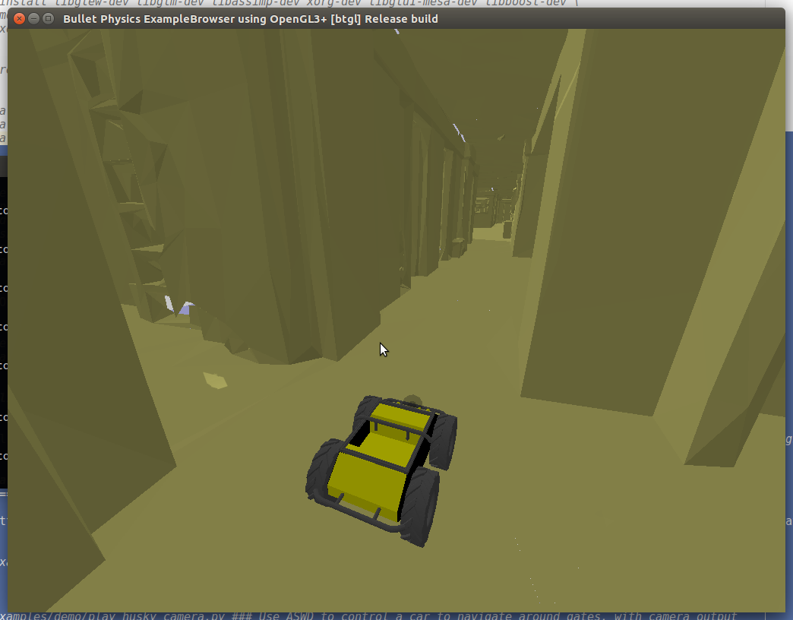
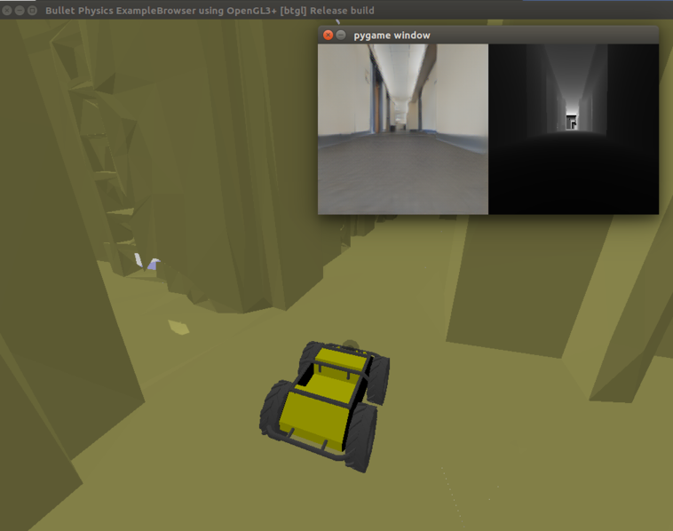
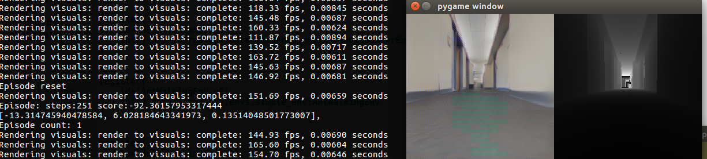
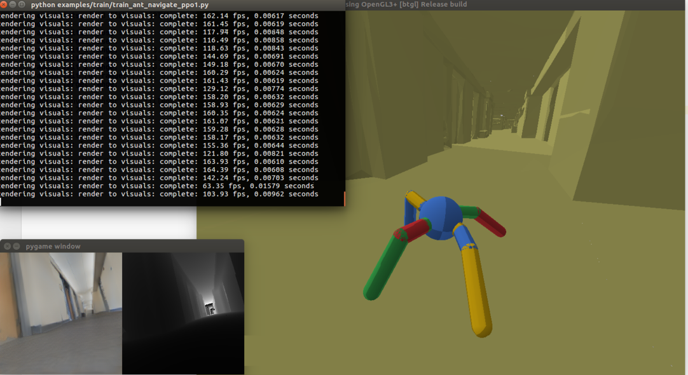
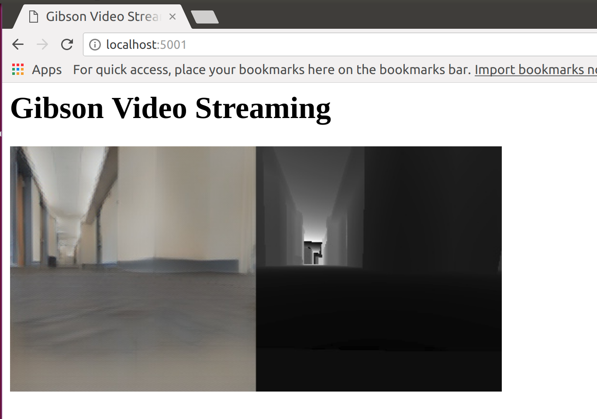

# Gibson Environment for Training Agents with Real-World Perception 
You shouldn't play video games all day, so shouldn't your AI! We built a virtual environment that offers real world experience for learnign perception. 


 
**Summary**: Perception and being active (i.e. having a certain level of motion freedom) are closely tied. Learning active perception and sensorimotor control in the physical world is cumbersome as existing algorithms are too slow to efficiently learn in real-time and robots are fragile and costly. This has given a fruitful rise to learning in simulation which consequently casts a question on transferring to real-world. The primary characteristics of Gibson environments are:   
**I.** being from the real-world and reflecting its semantic complexity through virtualizing real spaces,  
**II.** having a baked-in mechanism for transferring to real-world (Goggles function), and  
**III.** embodiment of the agent and making it subject to constraints of space and physics via integrating a physics engine ([Bulletphysics](http://bulletphysics.org/wordpress/)).  

**Naming**: Gibson environment is named after James J. Gibson, the author of "Ecological Approach to Visual Perception", 1979. “We must perceive in order to move, but we must also move in order to perceive” – JJ Gibson

Please see [Gibson environments website](http://gibson.vision/) for more technical details. This repository is intended for distribution of the environment and installation/running instructions.

[](https://youtu.be/KdxuZjemyjc "Click to watch the video summarizing Gibson environment!")


### Note
This is a 0.1.0 beta release, bug reports are appreciated. 

Table of contents
=================

   * [Installation](#installation)
        * [Quick Installation (docker)](#quick-installation)
        * [Building from source](#building-from-source)
        * [Uninstalling](#uninstalling)
   * [Quick Start](#quick-start)
   * [Coding your RL agent](#coding-your-rl-agent)
   * [Environment Configuration](#environment-configuration)

Installation
=================

The minimum system requirements are the following:

- Ubuntu 16.04
- Nvidia GPU with VRAM > 6.0GB
- Nvidia driver >= 384
- CUDA >= 9.0, CuDNN >= v7
<!-- @fei: separate requirements by choice of installaion method. -->
#### Download data

First, download environment assets data from [here](https://drive.google.com/open?id=1jV-UN4ePwsE9XYv8m4YbNiGxRI_WWpW0). Make a folder `gibson/assets` and put the downloaded `assets.tar.gz` file it in.
<!-- @fei: defined that gibson/assets is the home folder the user wishes to put the environment in. Check. -->

#### Installation Method

There are two ways to instal gibson, A. using our docker image (recommended) and B. building from srouce. 

A. Quick installation (docker)
-----

We use docker to distribute our software, you need to install [docker](https://docs.docker.com/engine/installation/) and [nvidia-docker2.0](https://github.com/nvidia/nvidia-docker/wiki/Installation-(version-2.0)) first. 

Run `docker run --runtime=nvidia --rm nvidia/cuda nvidia-smi` to verify your installation. 


1. Build your own docker image (recommended)
```bash
git clone -b dev https://github.com/fxia22/gibson.git 
cd gibson
#as mentioned above, download assets data file and put it into gibson/assets folder
./build.sh decompress_data ### Download data outside docker, in case docker images need to be rebuilt
docker build . -t gibson
```
If the installation is successful, you should be able to run `docker run --runtime=nvidia -ti --rm -e DISPLAY -v /tmp/.X11-unix:/tmp/.X11-unix gibson` to create a container.


2. Or pull from our docker image
```bash
docker pull xf1280/gibson:0.1
```
<!-- @fei: shoudln't 2 come first because it's easier? Unless it's not recommended. -->

B. Building from source
-----
If you don't want to use our docker image, you can also install gibson locally. This will require some dependencies to be installed. 

First, make sure you have Nvidia driver and CUDA installed. If you install from source, CUDA 9 is not necessary, as that is for nvidia-docker 2.0. Then, let's install some dependencies:

```bash
apt-get update 
apt-get install libglew-dev libglm-dev libassimp-dev xorg-dev libglu1-mesa-dev libboost-dev \
		mesa-common-dev freeglut3-dev libopenmpi-dev cmake golang libjpeg-turbo8-dev wmctrl \ 
		xdotool libzmq3-dev zlib1g-dev\
```	

Install required deep learning libraries: Using python3.5 is recommended. You can create a python3.5 environment first. 

```bash
pip install http://download.pytorch.org/whl/cu90/torch-0.3.0.post4-cp35-cp35m-linux_x86_64.whl 
pip install torchvision
pip install tensorflow==1.3
```
Clone the repository, download data and build
```bash
git clone https://github.com/StanfordVL/gibson_beta.git 
cd gibson
#as mentioned above, download assets data file and put it into gibson/assets folder
./build.sh decompress_data ### decompress data 
./build.sh build_local ### build C++ and CUDA files
pip install -e . ### Install python libraries
```

Install OpenAI baselines if you need to run training demo.

```bash
git clone https://github.com/fxia22/baselines.git
pip install -e baselines
```

Uninstalling
----

Uninstall gibson is easy. If you installed with docker, just run `docker images -a | grep "gibson" | awk '{print $3}' | xargs docker rmi` to clean up the image. If you installed from source, uninstall with `pip uninstall gibson`


Quick Start
=================

After getting into the docker container, you can run a few demos. You might need to run `xhost +local:root` to enable display. If you installed from source, you can run those directly. 
<!-- @fei: explain what "getting into the docker container" means, for newbies. -->
<!-- @fei: What does "you can run those directly" mean? -->

```bash
python examples/demo/play_husky_sensor.py ### Use ASWD keys on your keyboard to control a car to navigate around Gates building
```


You will be able to use ASWD keys on your keyboard to control a car to navigate around Gates building. A camera output will not be shown in this particular demo. 

```bash
python examples/demo/play_husky_camera.py ### Use ASWD keys on your keyboard to control a car to navigate around Gates building, while RGB and depth camera outputs are also shown.
```


You will able to use ASWD keys on your keyboard to control a car to navigate around Gates building. You will also be able to see the RGB and depth camera outputs. 

```bash
python examples/train/train_husky_navigate_ppo2.py ### Use PPO2 to train a car to navigate down the hall way in Gates building, using visual input from the camera.
```


By running this command you will start training a husky robot to navigate in Gates building and go down the corridor. You will see some RL related statistics in the terminal after each episode.
<!-- @fei: is this using RGB or depth too? text is unclear. -->


```bash
python examples/train/train_ant_navigate_ppo1.py ### Use PPO2 to train an ant to navigate down the hall way in Gates building, using visual input from the camera.
```


By running this command you will start training an ant to navigate in Gates building and go down the corridor. You will see some RL related statistics in the terminal after each episode.
<!-- @fei: is this using RGB or depth too? text is unclear. -->


Web User Interface
----
When running Gibson, you can start a web user interface with `python gibson/utils/web_ui.py`. This is helpful when you cannot physically access the machine running gibson or you are running on a headless cloud environment.





More examples can be found in `examples/demo` and `examples/train` folder.
<!-- @fei: we should at least list what other demos and train setups they'll find there. -->


Coding Your RL Agent
====
You can code your RL agent following our convention. The interface with our environment is very simple (see some examples in the end of this section).

First, you can create an environment by creating an instance of classes in `gibson/core/envs` folder. 


```python
env = AntNavigateEnv(is_discrete=False, config = config_file)
```

Then do one step of the simulation with `env.step`. And reset with `env.reset()`
```python
obs, rew, env_done, info = env.step(action)
```
`obs` gives the observation of the robot. `rew` is the defined reward. `env_done` marks the end of one episode, for example, when the robot dies. 
`info` gives some additional information of this step; sometimes we use this to pass additional non-visual sensor values.

We mostly followed [OpenAI gym](https://github.com/openai/gym) convention when designing the interface of RL algorithms and the environment. In order to help users start with the environment quicker, we
provide some examples at [examples/train](examples/train). The RL algorithms that we use are from [openAI baselines](https://github.com/openai/baselines) with some adaptation to work with hybrid visual and non-visual sensory data.
In particular, we used [PPO](https://github.com/openai/baselines/tree/master/baselines/ppo1) and a speed optimized version of [PPO](https://github.com/openai/baselines/tree/master/baselines/ppo2).


Environment Configuration
=================
Each environment is configured with a `yaml` file. Examples of `yaml` files can be found in `examples/configs` folder. Parameters for the file is explained below:

| Argument name        | Example value           | Explanation  |
|:-------------:|:-------------:| :-----|
| envname      | AntClimbEnv | Environment name, make sure it is the same as the class name of the environment |
| model_id      | space7      |   Scene id, in beta release, choose from space1-space8 |
| target_orn | [0, 0, 3.14]      |   Eulerian angle target orientation for navigating, the reference frame is world frame |
|target_pos | [-7, 2.6, -1.5] | target position for navigating, the reference frame is world frame |
|initial_orn | [0, 0, 3.14] | initial orientation for navigating |
|initial_pos | [-7, 2.6, 0.5] | initial position for navigating |
|fov | 1.57  | field of view for the camera, in rad |
| use_filler | true  | use neural network filler or not. It is recommended to leave this argument true. See [Gibson Environments website](http://gibson.vision/) for more information. |
|display_ui | true  | show pygame ui or not, if in a production environment (training), you need to turn this off |
|show_dignostic | true  | show dignostics overlaying on the RGB image |
|ui_num |2  | how many ui components to show |
| ui_components | [RGB_FILLED, DEPTH]  | which are the ui components, choose from [RGB_FILLED, DEPTH, NORMAL, SEMANTICS, RGB_PREFILLED] |
|output | [nonviz_sensor, rgb_filled, depth]  | output of the environment to the robot |
|resolution | 512 | resolution of rgb/depth image |
|speed : timestep | 0.01 | timestep of simulation in seconds |
|speed : frameskip | 1 | how many frames to run simulation for one action |
|mode | gui  | gui or headless, if in a production environment (training), you need to turn this to headless |
|verbose |false  | show dignostics in terminal |

<!-- @fei: in general, for the arguments that have a limited set of valid values, it's customary to list the feasible values (e.g. [false,true],[gui,headless], etc). The list can be made either in the explanation column or a new column.-->
<!-- @fei: for orientations/angles and distances/positions, we should define the values are in radian/degree and metric.-->
<!-- @fei: for non-naviational tasks, what should the navigation argument values be? e.g. target location-->
<!-- @fei: fdisplay_ui needs a couple of more sentences to properly define it.-->
<!-- @fei: in fshow_dignostic, define "dignostics" what will be shown.-->
<!-- @fei: ui_components is unclear. What components are these and how is this related to the components defined in ui_components? -->
<!-- @fei: "output" is important. Needs description and proper listing of valid values.  What components are these and how is this related to the components defined in ui_components? -->
<!-- @fei: "resolution". list valid values-->
<!-- @fei: "timestep" and "frameskip". if you remember, we had decided to clarify this with an example for newbies.-->
<!-- @fei: "mode". We need to define what each of "gui" and "headless" exactly do. We should expect people to find them by trial and error-->

